# Modern Asset Management System (InfraMonitor)
> Comprehensive Project Documentation

## 1. Introduction
Large infrastructure organizations manage critical physical assets such as substations, transformers, transmission lines, and electrical equipment distributed across multiple locations. **InfraMonitor** is a Modern Asset Management System designed to improve visibility, control, and efficiency by providing a centralized digital layer for asset information and monitoring.

## 2. Value Proposition
*   **Centralized Digital View**: A single source of truth for all physical assets.
*   **Structured Lifecycle**: Tracking from installation to decommissioning.
*   **Maintenance Intelligence**: Easy access to historical data and scheduled tasks.
*   **Visual Decision Support**: Dashboards for management to assess system health at a glance.
*   **Scalability**: A future-ready architecture designed to grow with the infrastructure.

## 3. Core Problems & Solutions

| Problem | InfraMonitor Solution |
|---------|----------------------|
| asset data scattered across silos | **Centralized Asset Registry** with unified search/filtering |
| Unknown asset age/condition | **Lifecycle Tracking** including installation dates and status |
| Inaccessible maintenance history | **Digital Maintenance Logs** linked directly to asset records |
| Manal reporting efforts | **Automated Validation & Reporting** via dashboards |
| Lack of high-level visibility | **Real-time Analytics** on asset distribution and health |

## 4. System Architecture

The system follows a modern client-server architecture with a secure REST API.

```mermaid
graph TD
    Client[("💻 Web/Mobile Client\n(React 19 + TypeScript)")]
    API[("🛡️ Secure REST API\n(Hono + Node.js)")]
    DB[("🗄️ Database\n(SQLite + Prisma)")]
    
    subgraph "Frontend Layer"
        Client -->|Auth Context| Auth[Authentication]
        Client -->|UI Components| Pages[Dashboards & Management]
    end

    subgraph "Backend Layer"
        API -->|JWT| Guard[Role Guard]
        API -->|ORM| Prisma
        Guard --> Routes[Asset/Maintenance Routes]
    end

    Routes --> Prisma
    Prisma --> DB
```

### Technology Stack
*   **Frontend**: React 19, TypeScript, Vite, Tailwind-like CSS Modules, Recharts
*   **Backend**: Node.js, Hono (Lightweight Web Framework), Zod (Validation)
*   **Database**: SQLite (Dev) / PostgreSQL (Prod ready), Prisma ORM
*   **Security**: BCrypt hashing, JWT Authentication, RBAC (Role-Based Access Control)

## 5. Database Design (ER Model)

The database is normalized to ensure data integrity and efficient querying.

## 6. Operational Workflows

### A. Asset Lifecycle Management
How assets are added and managed within the system.

### B. Maintenance Logging Flow
The process for technicians to record maintenance activities.

## 7. Security & Compliance

*   **Authentication**: Secure login using BCrypt for password hashing and JSON Web Tokens (JWT) for session management.
*   **Role-Based Access Control (RBAC)**:
    *   **ADMIN**: Full access to all modules (User management, Asset C/U/D, Audit Logs).
    *   **TECHNICIAN**: Can view assets and log maintenance records.
    *   **VIEWER**: Read-only access to dashboards and reports.
*   **Audit Logging**: Critical actions (Creating/Deleting assets) are automatically logged with user attribution to ensure accountability.

## 8. Future Roadmap

1.  **Mobile Field App**: Native mobile application for offline maintenance logging.
2.  **QR Code Integration**: (Already prototyping) Scan physical assets to instantly pull up digital records.
3.  **Predictive Analytics**: Use historical maintenance data to predict failure probability.
4.  **IoT Integration**: Direct feed from smart transformers/sensors into the Asset Status field.

---
*Generated by InfraMonitor Development Team*
