# A MAJOR PROJECT REPORT ON

# **INFRAMONITOR: MODERN ASSET MANAGEMENT SYSTEM**

**SUBMITTED IN PARTIAL FULFILLMENT OF THE REQUIREMENTS FOR THE AWARD OF THE DEGREE OF**
**BACHELOR OF TECHNOLOGY**
*(Computer Science & Engineering)*

---

**SUBMITTED BY:**
*   **NAME:** [Your Name]
*   **ROLL NO:** [Your Roll No]
*   **SEMESTER:** 8th (4th Year)

**UNDER THE GUIDANCE OF:**
*   [Mentor Name/Designation]

**DEPARTMENT OF COMPUTER SCIENCE & ENGINEERING**
*[Your College Name]*
*[City, State]*
*[Month, Year]*

---

## 📜 CERTIFICATE

This is to certify that the project report entitled **"InfraMonitor: Modern Asset Management System"** submitted by **[Your Name]** in partial fulfillment of the requirements for the award of the degree of **Bachelor of Technology in Computer Science & Engineering** is a bona fide record of work carried out by him/her under my supervision and guidance.

The content of this report has not been submitted to any other university or institute for the award of any degree or diploma.

**(Signature of Guide)**
[Name of Guide]
[Designation]

**(Signature of HOD)**
[Name of HOD]
Department of CSE

---

## 🙏 ACKNOWLEDGEMENT

I would like to express my deep sense of gratitude to my project guide, **[Name of Guide]**, for their valuable guidance, constant encouragement, and constructive criticism which have contributed immensely to the evolution of this project.

I am also grateful to **[Name of HOD]**, Head of the Department of Computer Science & Engineering, for providing the necessary infrastructure and resources to carry out this work.

Finally, I am indebted to my parents for their unceasing encouragement and support.

**[Your Name]**
*B.Tech (CSE) Final Year*

---

## 📄 ABSTRACT

In the era of Industry 4.0, managing physical infrastructure has become complex. Large organizations managing critical assets—such as electrical substations and transmission lines—struggle with fragmented data, leading to operational inefficiencies. **InfraMonitor** is a Modern Asset Management System designed to address these challenges by providing a centralized digital **"Single Source of Truth"**.

The system utilizes a modern full-stack approach: **React 19 & TypeScript** for a responsive frontend, and **Node.js with Hono** for a high-performance backend, with **Prisma ORM & SQLite** for data integrity.

**Key Features:**
*   Centralized Asset Registry
*   Automated Lifecycle Tracking
*   Digital Maintenance Logging
*   Role-Based Access Control (RBAC)

---

# CHAPTER 1: INTRODUCTION

## 1.1 Overview
InfraMonitor is a web-based tool designed to bridge the gap between physical hardware and digital records. It allows organizations to register assets, track geographical locations, monitor operational status, and log maintenance activities in real-time.

## 1.2 Problem Statement
*   **Data Silos**: Asset data is scattered across excel sheets and paper logs.
*   **Lack of Visibility**: Managers cannot see which assets are "Down" in real-time.
*   **Audit Issues**: Paper logs make it hard to verify who performed maintenance.
*   **Reactive Maintenance**: No historical data to predict failures.

## 1.3 Objectives
1.  **Digitize**: Move from paper/Excel to a structured database.
2.  **Centralize**: Ensure all teams view the same data.
3.  **Secure**: Use Role-Based Access Control (RBAC).
4.  **Streamline**: Allow digital ticket logging for technicians.

## 1.4 Scope
*   **In Scope**: Web Portal, authentication, asset CRUD, maintenance logs, dashboards.
*   **Out of Scope**: Direct IoT sensor integration (Phase 2), native mobile app.

---

# CHAPTER 2: SYSTEM ANALYSIS

## 2.1 Existing System
Currently, most organizations rely on manual ledgers and standalone spreadsheets. New assets are written in a "Stock Register," and maintenance is filed in physical folders.

## 2.2 Limitations of Existing System
*   **Data Redundancy**: Discrepancies between Finance and Maintenance ledgers.
*   **Slow Retrieval**: Finding history takes hours of manual searching.
*   **No Analytics**: Cannot generate performance graphs from paper.

## 2.3 Proposed System (InfraMonitor)
*   **Data Integrity**: Validated forms ensure correct data entry.
*   **Instant Retrieval**: Search by ID or Location in milliseconds.
*   **Accountability**: Every action is time-stamped and logged.

---

# CHAPTER 3: SYSTEM REQUIREMENTS

## 3.1 Functional Requirements

| Module | Requirement |
| :--- | :--- |
| **User Mgmt** | Admin can create users; Login via Email/Password; Roles (Admin, Tech, Viewer). |
| **Asset Mgmt** | Register assets (Name, Serial, Location); Track Status (Operational/Down). |
| **Maintenance** | Technicians log tickets (Date, Issue, Priority); Status updates automatically. |
| **Dashboard** | High-level summary: Total Assets, Active Maintenance, Critical Alerts. |

## 3.2 Hardware & Software Requirements

*   **OS**: Windows 10/11, Linux, or macOS
*   **Runtime**: Node.js (v18+)
*   **Database**: SQLite (Dev) / PostgreSQL (Prod)
*   **Browser**: Chrome / Edge (Latest)
*   **Hardware**: i3 Processor via 4GB RAM minimum

---

# CHAPTER 4: SYSTEM DESIGN

## 4.1 System Architecture
The application follows a Client-Server architecture.

```mermaid
graph TD
    Client[("💻 Web Client\nReact 19")]
    Server[("🚀 Backend Server\nHono + Node.js")]
    DB[("🗄️ Database\nSQLite + Prisma")]

    Client -- "HTTP Requests (JSON)" --> Server
    Server -- "Queries" --> DB
    DB -- "Data Results" --> Server
    Server -- "Response" --> Client
```



## 4.2 Database Design (ER Diagram)

```mermaid
erDiagram
    USER ||--o{ AUDIT_LOG : generates
    LOCATION ||--o{ ASSET : houses
    VENDOR ||--o{ ASSET : supplies
    ASSET ||--o{ MAINTENANCE_RECORD : has

    USER {
        int id PK
        string email
        string role "ADMIN, TECH"
    }

    ASSET {
        int id PK
        string name
        string status "OPERATIONAL, DOWN"
        int locationId FK
    }

    MAINTENANCE_RECORD {
        int id PK
        date date
        string priority
        int assetId FK
    }
```



## 4.3 Data Flow Diagram (Level 0)


---

# CHAPTER 5: IMPLEMENTATION DETAILS

## 5.1 Technology Stack
*   **Frontend**: React 19, TypeScript, Vite (Fast build tool).
*   **Backend**: Hono (High-performance web framework for Node.js).
*   **Database**: Prisma ORM (Type-safe database access).

## 5.2 Folder Structure

```
/infra-monitor
├── /client (Frontend)
│   ├── /src
│   │   ├── /components  (Buttons, Cards)
│   │   ├── /pages       (Dashboard, Login)
│   │   ├── /context     (Auth States)
│   │   └── main.tsx
├── /server (Backend)
│   ├── /src
│   │   ├── /routes      (API endpoints)
│   │   ├── /middleware  (Security)
│   │   └── index.ts
│   └── prisma/schema.prisma
```

---

# CHAPTER 6: TESTING

## 6.1 Test Cases

| Test ID | Scenario | Input Data | Expected Result | Status |
| :--- | :--- | :--- | :--- | :--- |
| **TC-01** | Valid Login | user@test.com / pass123 | Redirect to Dashboard | **PASS** |
| **TC-02** | Invalid Pass | user@test.com / wrong | Show Error Message | **PASS** |
| **TC-03** | Create Asset | "Transformer X1" | Saved in Database | **PASS** |
| **TC-04** | Empty Form | (Empty Fields) | Validation Error | **PASS** |

---

# CHAPTER 7: RESULTS

*(Placeholders for your Screenshots)*

1.  **Login Page**: Secure entry point.
2.  **Dashboard**: Main overview with charts.
3.  **Asset List**: Searchable table of inventory.
4.  **Maintenance Form**: Modal for logging work.

---

# CHAPTER 8: CONCLUSION & FUTURE SCOPE

## 8.1 Conclusion
InfraMonitor successfully digitizes infrastructure management. It eliminates data silos, ensures data integrity through a centralized database, and provides a secure, role-based environment for managing assets.

## 8.2 Future Scope
*   **IoT Integration**: Real-time sensor feeds for temperature/voltage.
*   **Predictive Maintenance**: AI models to predict failure before it happens.
*   **Mobile App**: Native app for offline field use.

---

# REFERENCES
1.  React 19 Documentation (react.dev)
2.  Hono Framework Docs (hono.dev)
3.  Prisma ORM Guide (prisma.io)